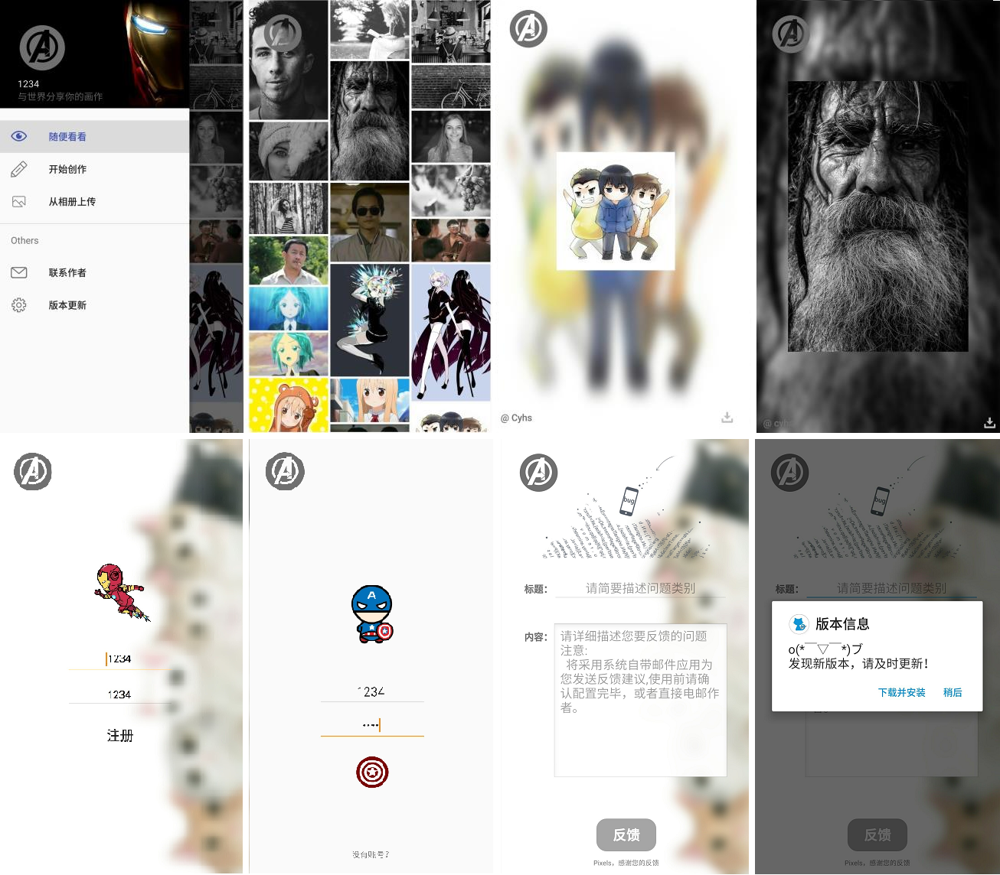

# Pixels

	

	
    
    

#### A simple photo community app that implements data communication with the server.

#### The purpose is to help my classmate complete the task and exercise my abilities.

- Version control

- Json

- Image download

- Sketchpad based on [Makers](https://github.com/dsandler/markers)

- Super Hero

- Feedback

